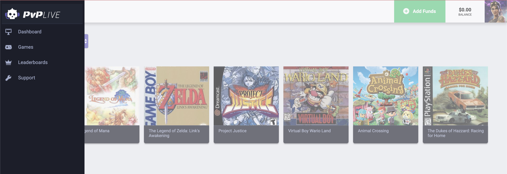

# personal-demo-mockup

This was a coding challenge for a prospective employer to create a relatively non-functional SPA based off a mockup using any framework or tools of my choice. I chose to use Reactjs.

